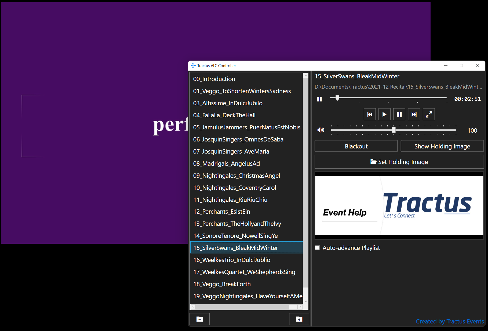

# Tractus VLC Controller

The Tractus VLC Controller is a simple wrapper around the VLC Media Player for Windows 10 and up. It allows for fine-grain control over video playback. 

- Pause on last frame by default
- Keep video playback window separate, with no OSD, no resizing when video resolution changes
- Enable "blackout" of videos
- Enable a "holding slide" over top of videos
- Volume slider from 0% to 200%

With auto-play enabled, this can be used as a basic digital signage application.

## Support this Project

You can support this project with a ⭐, report an issue, or placing a pull request.

You can also support by spreading the word! Share this utility with your colleagues and friends.

## Commercial Support

**Commercial Support is available.** Contact info@tractus.ca for more information.

## Build from Source

This project target .NET 6 and WPF on Windows 10 and above. To build, please install Visual Studio 2022.

## Icons

Icons used in this app are from the Icomoon project. https://icomoon.io/#icons-icomoon

